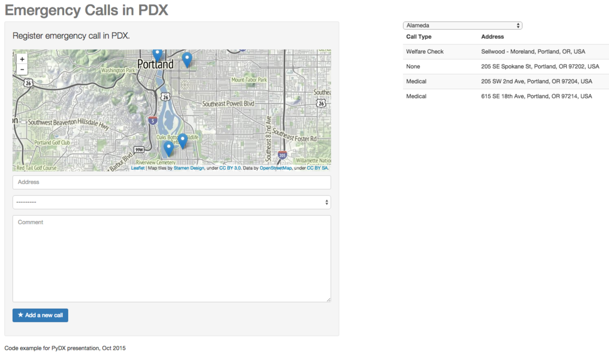
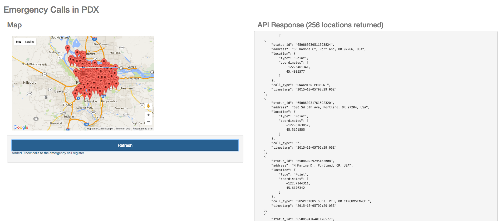

# PyDX-python-geodata-maps

(c) Hannes Hapke 2015

# Presentation and video
I will add the presentation slides and the video once the [PyDX 2015](http://www.pydx.org) is over and the video is uploaded to (pyvideo.org)[http://www.pyvideo.org]

# Geocoder and other Python examples
The folder `geocoder` contains four different code samples:
- address geocoder example
- ip address geocoder example
- generating static map images (street maps, satelitte maps, etc.)
- extracting geo data from images

Install the following three packages:
- Geocoder: `pip install geocoder`
- motionless: `pip install motionless`
- Geocoder: `pip install -e git+git@github.com:hanneshapke/pyexif.git#egg=pyexif`

# Shapefile example
The folder `shapefile` contains a simple how-to for using the amazing [Portland Atlas by @Caged](https://github.com/caged/portland-atlas)

# GeoDjango Example
This example code demonstrates how to generate `Points` in GeoDjango/postGIS and how to query them based on GeoDjango queries.

The example demonstrates:
- Simple GeoModel
- Demonstrate the GeoDjango Admin
- How to save Points
- How to search for Points within a Polygon
- Leaflet Maps

# GeoDjango + REST API example
This example code deonstrates how to move from a general GeoDjango project to an API endpoint based on the [Django REST Framework](http://www.django-rest-framework.org/)

The example demonstrates:
- Create an API endpoint through the Django REST Framework
- Download the 20 latest twitter messages by the Portland police
- Set up a GeoSerializer
- Demo of AngularJS ng-map
- Limit the API requests by the boudning box of the client's map (This limits your client/server requests)

